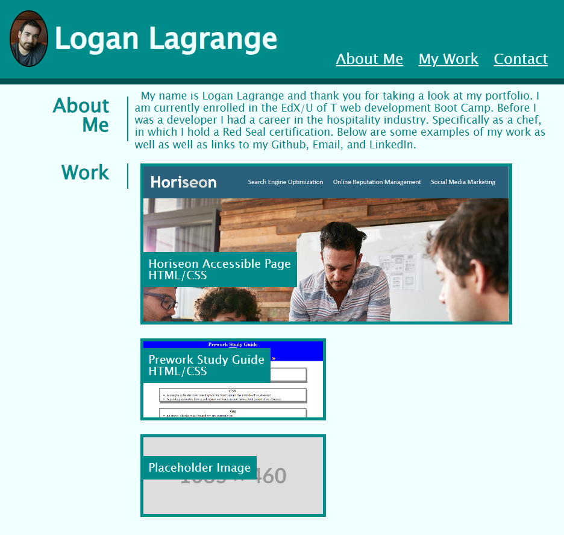

# logans-project-portfolio

## Description

This project was created to provide prospective employers with an easy to use webpage to view my past work, find information about me as well as my contact information.  It was made to also serve itself as an example of my work in and of itself in addition to displaying other work.

## Installation

N/A

## Usage

The page can be accessed via this link: https://loganlagrange.github.io/logans-project-portfolio/

The page is used by viewing information about myself in the 'about me' section, my work in the 'my work' section and my contact information in the 'contact' section. There is a nav bar in the header with links that will jump to that section of the page when clicked. In addition the images of my projects contain links to the deployed pages that can be accessed simply by clicking on them.

## Credits
N/A

## LIcense
See LICENSE in repo.